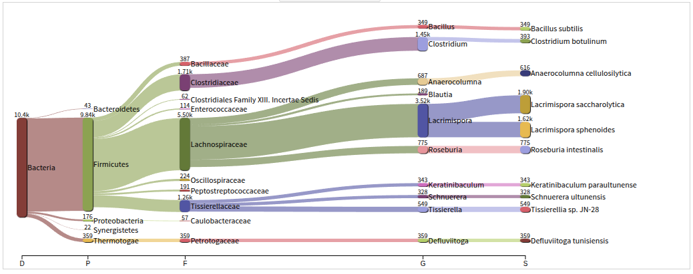

# KraKen2-Bracken
This pipeline uses to classified classify DNA or RNA reads by matching them to known sequences in a KRAKEN2 database.

## Usage
```
bash run_kraken_bracken.sh <input.fastq.gz>
```

## Output
```
├── sample.bracken_output.txt
├── sample_bracken_run.log
├── sample.classified.fastq
├── sample.kraken2.report_bracken_species.txt
├── sample.kraken2.report.txt
└── sample.unclassified.fastq
```

## Bracken Vistualization
You can view and explore the `sample.kraken2.report_bracken_species.txt` file using [Pavian](https://fbreitwieser.shinyapps.io/pavian/), a web-based tool designed for interactive visualization of Kraken and Bracken results.

The example of output:


## 🔍 What Does Kraken Do?
Kraken assigns each read to one or more levels in the taxonomic tree (like genus, species, family, etc.).

It gives you a list of classifications, not just species.

## 📊 What Does Bracken Do?
**Bracken** takes Kraken's output and estimates the abundance of organisms at one specific level (e.g., just at the species level).

This helps you know how many reads really come from each species, not just how many were classified.

## ⚙️ Requirements
Before using Bracken, you must first install:
- [Kraken 2](https://github.com/DerrickWood/kraken2/)

## Citation
[Kraken2 GitHub](https://github.com/DerrickWood/kraken2)

[Bracken GitHub](https://github.com/jenniferlu717/Bracken)

[Pavion GitHub](https://github.com/fbreitwieser/pavian?tab=readme-ov-file)
